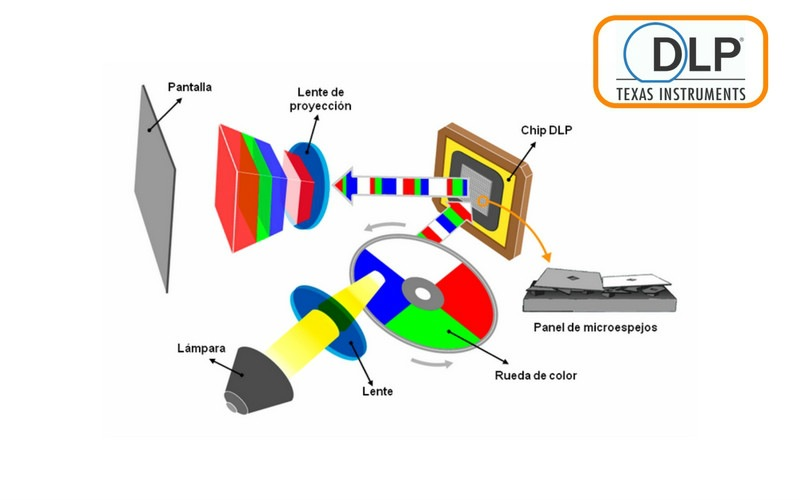

# 🔍 Características de un proyector  

Los proyectores cuentan con varias características clave que determinan su desempeño y calidad de imagen:  

## 📌 Parámetros esenciales  

✅ **Luminosidad**: Medida en **lúmenes**, determina el brillo de la imagen proyectada.  
✅ **Resolución**: Define la **nitidez** de la imagen (ej. **1080p, 4K**).  
✅ **Contraste**: Diferencia entre los puntos más **claros y oscuros** de la imagen.  
✅ **Tamaño de proyección**: Rango de **tamaños de imagen** que puede producir.  
✅ **Tecnología de proyección**: Método utilizado para crear la imagen (**LCD, DLP**, etc.).  
✅ **Conectividad**: Opciones de entrada como **HDMI, VGA, USB**, entre otras.  
✅ **Vida útil de la lámpara**: Duración esperada de la **fuente de luz**. 

Estas características influyen en la calidad y utilidad del proyector, permitiendo elegir el modelo adecuado según la necesidad. 🎥  

