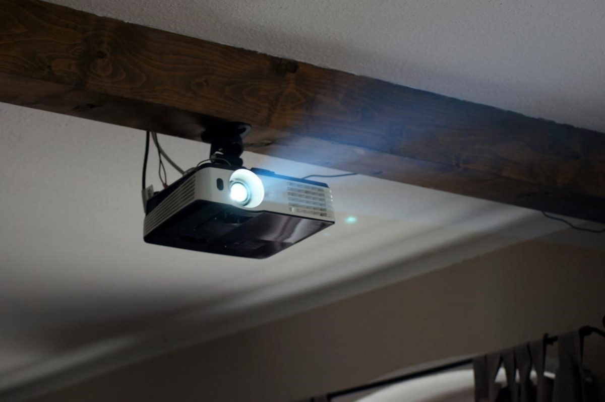

# 🌟 Ejemplos comerciales.

Actualmente, en el mercado existen diversos modelos de proyectores con distintas tecnologías y aplicaciones. Algunos de los más populares son:  

  
| **Tecnología**           | **Modelo y Descripción**                                                                                                                                     |
|--------------------------|------------------------------------------------------------------------------------------------------------------------------------------------------------|
| **🔹 LCD**                | 📌 **Epson Home Cinema 2250** – Proyector **1080p** ideal para **cine en casa**.                                                                  |
| **⚫ DLP**                | 📌 **BenQ TK850** – Proyector **4K** diseñado para **deportes y entretenimiento**.                                                                  |
| **🔳 LCoS**               | 📌 **Sony VPL-VW325ES** – Proyector **4K de alta gama** con excelente calidad de imagen.                                                               |
| **💡 LED**                | 📌 **Optoma ML750** – **Proyector portátil** perfecto para **presentaciones**.                                                                          |
| **🔴 Láser**              | 📌 **LG CineBeam HU80KSW** – **Proyector láser 4K** con **Smart TV integrada**.                                                                         |

 

Estos modelos representan algunas de las mejores opciones en cada categoría según la necesidad del usuario. 🎬  

